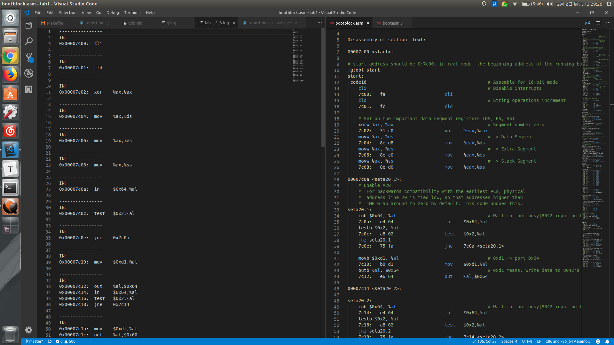
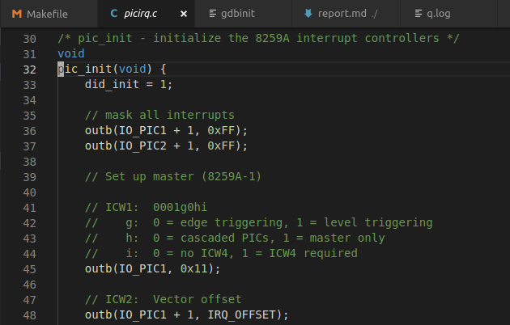
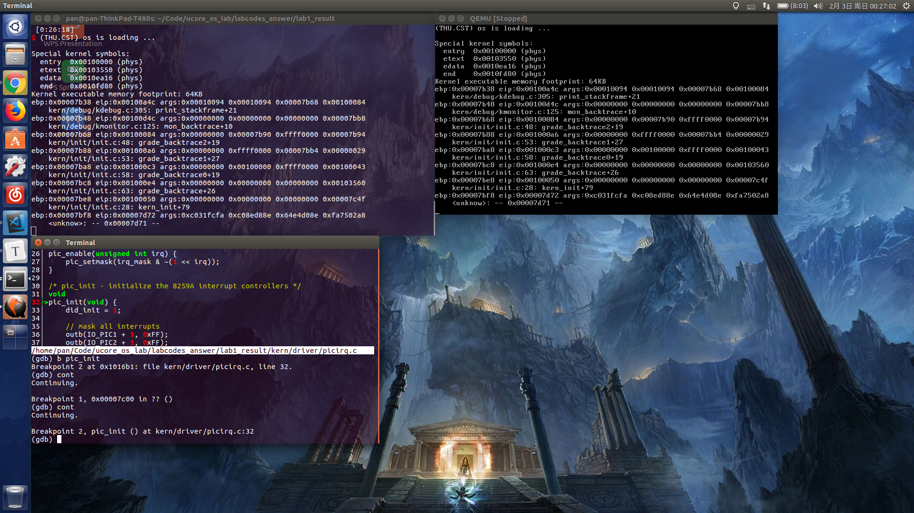

## lab1实验报告  

### 相关知识点   
#### 这些是与本实验有关的原理课的知识点：

* 系统启动
* x86的中断和异常机制
* 用中断实现系统调用
* 中断描述符表  
#### 此外，本实验还涉及如下知识点：

* 硬盘驱动程序
* ELF文件格式
#### 如下知识点在原理课中也很重要，但我没有发现实验中有所对应：

* 无  

----

### 练习1  

1. ucore.img生成过程：  
   (1) 编译/kern目录下的源码  
   编译.o文件的选项含义为(以init.c的编译为例)：

   ```shell
   + cc kern/init/init.c
   gcc     
           -Ikern/init/ 把kern/init 添加到头文件的目录集合中  
           -fno-builtin 不识别没有以__builtin_开头的内置函数
           -Wall  开启所有编译警告 
           -ggdb 产生用于gdb的调试信息
           -m32 编译32位程序
           -gstabs 生成stabs类型的调试信息
           -nostdinc  禁止在系统目录中寻找头文件，即不使用系统提供的库
           -fno-stack-protector 
           -Ilibs/  把libs/添加到搜索头文件的目录集合中
           -Ikern/debug/  把kern/debug添加到搜索头文件的目录集合中
           -Ikern/driver/  把kern/driver 添加到搜索头文件的目录集合中
           -Ikern/trap/  把kern/trap 添加到搜索头文件的目录集合中
           -Ikern/mm/  把kern/mm 添加到搜索头文件的目录集合中
           -c kern/init/init.c    编译 
           -o obj/kern/init/init.o输出写入obj/kern/init/init.o
   ```
   编译得到的.o文件存放在obj/kern/下  
   (2) 链接得到kernel映像  

   将obj/kern目录下的.o文件链接生成bin/kernel文件。  

   链接的命令为

   ```shell
   ld -m elf_i386 -nostdlib -T tools/kernel.ld -o bin/kernel obj/***.o
   ```

   * -m 选项指定了要生成的映像为32位ELF映像

   * -nostdlib 选项指明不使用内建的库

   * -T 选项指定了tools/kernel.ld为链接脚本，其中规定了映像执行的入口，链接的内存布局等。

   * -o 选项指定了哪些.o文件被链接进来。  

   (3) 编译bootloader代码  

   命令为`gcc -Iboot/ -fno-builtin -Wall -ggdb -m32 -gstabs -nostdinc -fno-stack-protector -Ilibs/ -Os -c boot/bootasm.S -o obj/boot/bootasm.o`。

   编译选项与步骤（1）中给出的几乎完全一样，重复部分不再赘述。

   比较值得注意的是，在bootloader的编译过程中，加入了生成代码大小优化选项-Os，这是为了尽可能保证bootloader启动扇区的大小不大于510字节。

   (4) 生成bootlodaer二进制代码

   相关的命令为objcopy -S -O binary obj/bootblock.o obj/bootblock.out。

   相关选项的含义：

   1. `-S`不拷贝重定位信息和调试信息
   2. -O binary 拷贝二进制代码

   (5) 生成启动扇区  

   编译`tools/sign.c`并执行。

   ​	执行过程中检查`obj/bootblock.out`文件的大小是否超过510字节，如果超过则终止并报错。否则利用bootlock.out文件生成启动扇区`bin/bootblock`。

   (6) 制作磁盘镜像文件ucore.img  

   * 首先初始化磁盘镜像文件ucore.img，通过dd命令,对ucore.img的5120000字节置零。

     ```shell
     dd if=/dev/zero of=bin/ucore.img count=10000
     ```

   * 然后通过dd命令将bootloader写入到ucore.img之中。conv代表直接写入，不清空原有内容。

     ```shell
     dd if=bin/bootblock of=bin/ucore.img conv=notrunc
     ```

   * 通过dd命令将kernel写入到ucore.img的第1个扇区中。seek选项指定了of中开始写入的起始位置。

     ```shell
     dd if=bin/kernel of=bin/ucore.img seek=1 conv=notrunc
     ```

2. 一个合法的主引导扇区需要的条件：    

   1、符合扇区大小的基本要求，大小为512字节  
   2、最后一个字节为0xAA， 倒数第二个字节为0x55  (小端序)

----
### 练习2  

使用qemu执行并调试lab1中的软件。

1、从CPU加电之后执行的第一条指令开始，单步跟踪BIOS的执行。

根据ucore_os_docs中lab1的附录B，修改tools/gdbinit

```shell
set architecture i8086
target remote :1234
```

然后在lab1目录下执行make debug，gdb将停在BIOS第一条指令处，通过

```shell
si
si
……
```

可以单步执行。

2、在初始化位置0x7c00设置实地址断点，测试断点正常。

在tools/gdbinit中追加如下代码

```shell
break *0x7c00
c
```

重新执行make debug可以发现gdb在0x7c00地址前暂停。

3、从0x7c00开始跟踪代码运行，将单步反汇编得到的代码与bootasm.S和bootblock.asm进行比较。

起初采用gdb单步调试并在命令行中打印出汇编代码的方法，可以得到大致对照，但是效率较低。

发现可以用-d in_asm -D q.log选项得到qemu代码的反汇编结果。

修改了Makefile中的debug部分：

```makefile
debug: $(UCOREIMG)
	$(V)$(QEMU) -d in_asm -D q.log -S -s -parallel stdio -hda $< -serial null &
	$(V)sleep 2
	$(V)$(TERMINAL) -e "gdb -q -tui -x tools/gdbinit"
```

修改tools/gdbinit，追加

```shell
b *0x7c00
c
```

执行make debug之后通过gdb单步执行，可以看到0x7c00-0x7c4a部分，得到的汇编代码与bootblock.asm中的汇编代码几乎都可以对应起来。




4、自己找一个bootloader或内核中的位置，设置断点并进行测试。

设置断点的位置





### 练习3  

首先禁止中断、初始化重要的段寄存器，

1、如何开启A20？

* 等待8042输入缓冲区空闲
* 想8042键盘缓冲区输出0xd1
* 等待8042输入缓冲区空闲
* 8042输入缓冲端口输出0xdf

2、为何开启A20？

​	为保证后向兼容，A20线默认是低电平，在这种情况下可寻址空间只有1M。开启A20是为了能够使用完整的4G内存区域。

3、如何初始化GDT表?

​      内存中已经有一个简易的GDT表，仅包含三个全局描述符，分别为空描述符、代码段描述符、数据段描述符。通过lgdt指令直接加载即可。但需要注意GDT表是4字节对齐的。

4、如何进入保护模式？

​      将cr0寄存器的PE位设置为1,即可切换到保护模式，但实际上置1之后并没有马上开始执行32位的代码，我们需要一个long jump指令来更新cs寄存器，从而真正进入32位保护模式。

​      转到保护模式后，还需要设置除了cs之外的其他段寄存器、并且初始化栈指针。

### 练习4  

1、bootloader如何读取硬盘扇区？

* bootloader通过内联汇编生成读取扇区的代码，具体相关的汇编指令为inb`、`insl`、`outb，将扇区读取到指定位置。
  1、等待磁盘控制器就绪
  2、用outb指令设置要读取的数量、读取的LBA（这里使用LBA编址方式）
  3、用outb指令向控制端口写入读取扇区命令
  4、用repne insl指令读取相应数量的双字（128个双字即为512字节），由于有repne前缀，这一条指令实际上是一个循环

2、bootloader如何加载ELF格式的OS？

​	首先获取ELF文件头，然后根据ELF格式的文件头中包含的信息，得到程序在文件中的起始位置以及大小。最后即可调用readsect函数逐个扇区加载OS。

###  练习5  

```c
void
print_stackframe(void) {
    uint32_t ebp = read_ebp();
    uint32_t eip = read_eip();
    uint32_t a,b,c,d;
    int i = 0;
    while(i != STACKFRAME_DEPTH && ebp != 0){
        a = *(uint32_t *)(ebp + 8);
        b = *(uint32_t *)(ebp + 12);
        c = *(uint32_t *)(ebp + 16);
        d = *(uint32_t *)(ebp + 20);
        cprintf("ebp:0x%08x,eip:0x%08x args:0x%08x 0x%08x 0x%08x 0x%08x", 
            ebp, eip, a, b, c, d);
        cprintf("\n");
        print_debuginfo((uint32_t)eip - 1);
        eip = *(uint32_t *)(ebp + 4);
        ebp = *(uint32_t *)(ebp);
    }
}
```

* 根据提示，当前函数的ebp指向的地址存储的是调用者的ebp，当前函数的ebp+4指向的地址是当前函数的返回地址eip。再之后的ebp+8、ebp+12....等存储的是传入的参数，此处只打印出4个。

* 并且根据约定，进入内核之前ebp被设置为0。

### 练习6  

1、中断描述符表的表项大小为8个字节，其中，第二个字节为段选择子，第一个和最后一个字节拼接起来之后为段内位移。

2、根据注释实现即可，对应的函数实现如下：

```c
/* idt_init - initialize IDT to each of the entry points in kern/trap/vectors.S */
void
idt_init(void) {
     extern uintptr_t __vectors[];
     int i;
     for(i = 0; i < 256; i++){
         SETGATE(idt[i], 0, GD_KTEXT ,__vectors[i], DPL_KERNEL);
     }
     lidt(&idt_pd);
}
```

```c
/* trap_dispatch - dispatch based on what type of trap occurred */
static void
trap_dispatch(struct trapframe *tf) {
    char c;
    switch (tf->tf_trapno) {
    case IRQ_OFFSET + IRQ_TIMER:
        ticks++;
        if(ticks % TICK_NUM == 0){
            print_ticks();
        }
        break;
    case IRQ_OFFSET + IRQ_COM1:
        c = cons_getc();
        cprintf("serial [%03d] %c\n", c, c);
        break;
    case IRQ_OFFSET + IRQ_KBD:
        c = cons_getc();
        cprintf("kbd [%03d] %c\n", c, c);
        break;
    default:
        // in kernel, it must be a mistake
        if ((tf->tf_cs & 3) == 0) {
            print_trapframe(tf);
            panic("unexpected trap in kernel.\n");
        }
    }
}
```

### Challenge部分：

#### Challenge1  

​	根据ucore的中断机制，产生中断时，临时栈中存储了对应的寄存器值与trapframe的定义是一致的：

```c
struct trapframe {
    struct pushregs tf_regs;
    uint16_t tf_gs;
    uint16_t tf_padding0;
    uint16_t tf_fs;
    uint16_t tf_padding1;
    uint16_t tf_es;
    uint16_t tf_padding2;
    uint16_t tf_ds;
    uint16_t tf_padding3;
    uint32_t tf_trapno;
    /* below here defined by x86 hardware */
    uint32_t tf_err;
    uintptr_t tf_eip;
    uint16_t tf_cs;
    uint16_t tf_padding4;
    uint32_t tf_eflags;
    /* below here only when crossing rings, such as from user to kernel */
    uintptr_t tf_esp;
    uint16_t tf_ss;
    uint16_t tf_padding5;
} __attribute__((packed));
```

按照慕课的提示，需要修改的栈中内容为：

​	es，ds，cs，eflags，esp，ss（从ring0到ring3时需要修改）

其中，ErrorCode、eip、cs、eflags是由硬件CPU负责压入栈的，gs、fs、es、ds、trapno则是由异常处理程序压入栈的。而esp、ss只有在从ring0到ring3的转换中会在iret指令中被pop出栈。所以近需要在内核态切换到用户态时考虑这两项。

ring0到ring3：

```c
//进入该中断之前，手动下拉栈顶0x8字节，为esp、ss分配内存。
case T_SWITCH_TOU:
	if(tf->tf_cs != USER_CS){
		tf->tf_cs = USER_CS;
		tf->tf_ds = USER_DS;
		tf->tf_es = USER_DS;
		tf->tf_ss = USER_DS;
		tf->tf_eflags |= FL_IOPL_MASK;	//设置IOPL，使特权极切换之后正常使用IO指令
		tf->tf_esp = (uint32_t)tf + sizeof(struct trapframe) - 8;//设置在iret时要弹出的栈顶
	}
break;
```

ring3到ring0：

```c
case T_SWITCH_TOK:
	if(tf->tf_cs != KERNEL_CS){		//首先判断是否存在转换
		tf->tf_cs = KERNEL_CS;
		tf->tf_ds = KERNEL_DS;
		tf->tf_es = KERNEL_DS;
		tf->tf_eflags &= ~FL_IOPL_MASK;		//设置IOPL，使特权极切换之后正常使用IO指令
	}
break;
```

#### Challenge2:  

​	可以借用Challenge1中的实现，在处理键盘中断的时候调用Chanllege1的相关函数，即可进行特权级的切换。


